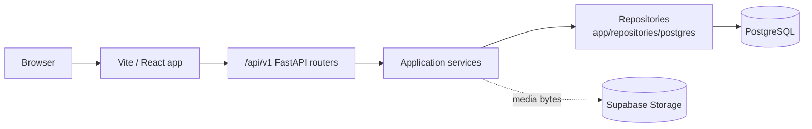

# Architecture

Linguini is a monorepo with separate JavaScript and Python applications:

```text
linguini/
├── frontend/             React/Vite client, routes, components, and state
├── backend/
│   ├── app/              FastAPI entrypoint, schemas, services, and repositories
│   ├── prisma/           Prisma schema and SQL migrations
│   └── tests/            API, schema, and PostgreSQL integration tests
├── docs/                 MkDocs source
└── .github/workflows/    CI and GitHub Pages workflows
```

## Request flow



The frontend must never query the database directly. It calls the API and
keeps database credentials on the backend. API JSON uses camelCase while
Python attributes and persistence code use snake_case; Pydantic models handle
the boundary.

## Backend API route modules

All modules below are mounted below `/api/v1`.

| Module | Purpose |
| --- | --- |
| `health.py` | Liveness response for the API process. |
| `home.py` | Home-screen summary for the current demo user. |
| `users.py` | Read and update the demo user and language profiles. |
| `media.py` | Media metadata, upload confirmation, and preloaded scenes. |
| `sessions.py` | Create, analyze, review, inspect, complete, or abandon practice sessions. |
| `tasks.py` | Read and act on session tasks, attempts, hints, completion, and skipping. |
| `vocabulary.py` | Read the current user's vocabulary and daily vocabulary. |
| `progress.py` | Read learning progress calculated from persisted encounters. |
| `journals.py` | Read, write, revise, complete, and suggest changes to journal entries. |

## Frontend routes

The route tree is defined in `frontend/src/App.tsx`.

| Route | Screen or purpose |
| --- | --- |
| `/` | Welcome screen. |
| `/onboarding` | Initial learner setup. |
| `/login` | Login surface; authentication is not implemented. |
| `/home` | Home and next learning action. |
| `/practice` | Choose or upload a practice scene. |
| `/practice/:sceneId/*` | Preloaded-scene flow. |
| `/practice/sessions/:sessionId/analysis` | Review analysis suggestions. |
| `/practice/sessions/:sessionId/mic-test` | Microphone check. |
| `/practice/sessions/:sessionId/learn` | Learning task list. |
| `/practice/sessions/:sessionId/learn/:taskId` | Individual learning task. |
| `/practice/sessions/:sessionId/ispy-1` | First I-Spy direction. |
| `/practice/sessions/:sessionId/ispy-2` | Second I-Spy direction. |
| `/practice/sessions/:sessionId/summary` | Session summary. |
| `/progress` | Learner progress. |
| `/vocabulary` | Saved vocabulary. |
| `/journal` | Monthly journal. |
| `/journal/new` | New journal entry. |
| `/journal/:entryId` | Journal entry detail and revisions. |
| `/profile` | Profile and language settings. |
| `/profile/edit` | Profile editing form. |
