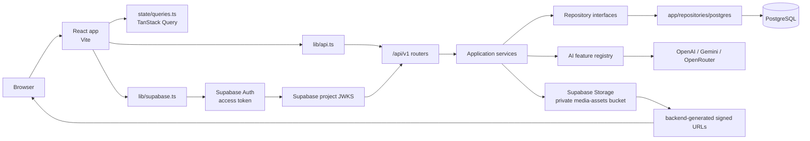
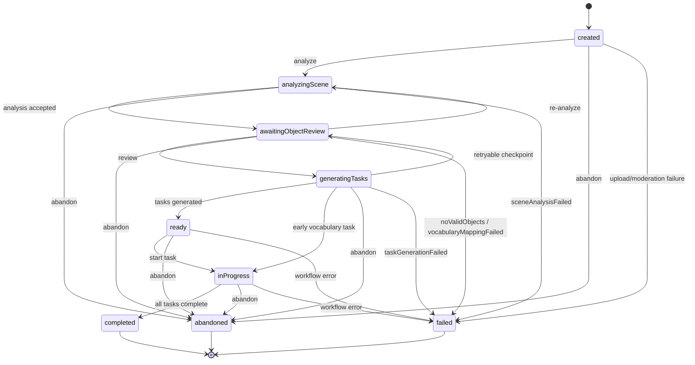

# Architecture

## Monorepo layout

```text
linguini/
├── frontend/             React 19/Vite SPA, routes, state, and components
├── backend/
│   ├── app/api/           FastAPI entrypoint, auth, dependencies, routers
│   ├── app/services/      application and workflow services
│   ├── app/repositories/  repository interfaces and PostgreSQL adapters
│   ├── app/schemas/       Pydantic API/domain models
│   ├── app/ai/            providers, feature services, validation, tracing
│   ├── prisma/            Prisma schema and SQL migration history
│   └── tests/             unit, API, evaluation, and PostgreSQL tests
├── landing/               Next.js 16 App Router marketing site
├── marketing/             launch-kit source files; not deployed
├── docs/                  MkDocs source
└── .github/workflows/     CI and Pages deployment
```

## Request and integration flow



The frontend never queries PostgreSQL directly. JSON uses camelCase at the
HTTP boundary while Python attributes and SQLAlchemy columns use snake_case.
Pydantic models perform the conversion. The backend keeps the Supabase service
role key and signs private `media-assets` URLs; it does not expose that key to
the browser.

## Backend layers

| Layer | Source location | Responsibility |
| --- | --- | --- |
| HTTP routers | `backend/app/api/routes/` | Parse requests, select response models, and delegate. |
| Services | `backend/app/services/` | Application use cases, ownership checks, and workflow orchestration. |
| Repository interfaces and adapters | `backend/app/repositories/`, `backend/app/repositories/postgres/` | Keep persistence contracts separate from SQLAlchemy/PostgreSQL implementation. |
| Schemas | `backend/app/schemas/` | Pydantic validation, enum values, and camelCase API serialization. |
| AI | `backend/app/ai/` | Provider adapters, feature registry, prompts, deterministic validation/repair, and observability. |

## Session lifecycle

`SessionStatus` is enforced by compare-and-set transitions in
`app/repositories/postgres/workflow.py`. `PracticeService` selects the active
language profile and delegates to that repository. Processing work may be
reaped after 15 minutes and receives the corresponding failure code.



The schema also defines `imageUploadFailed`, `imageModerationFailed`, and
`vocabularyMappingFailed`; these are stored on `Session.failureCode` when their
corresponding workflow stage fails. Terminal states cannot transition again.

## Background work

`backend/app/services/background.py` defines `BackgroundRunner`. The default
`InlineBackgroundRunner` executes synchronously for tests and offline deploys.
`ThreadPoolBackgroundRunner` uses a bounded `ThreadPoolExecutor`, reports
uncaught job errors, and is used when the application chooses an asynchronous
runner. Scene analysis and task generation submit work through this seam rather
than embedding a provider call in the HTTP response path.
