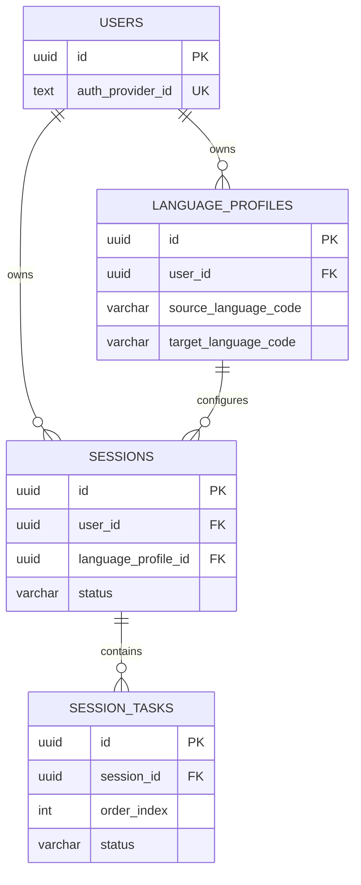

# Database

Prisma owns the PostgreSQL schema and migration history. The Python application
uses SQLAlchemy and psycopg at runtime; it does not use Prisma as an ORM.

## Models

The Prisma schema currently contains these 19 models:

1. `User`
2. `LanguageProfile`
3. `PreloadedScene`
4. `MediaAsset`
5. `VocabularyItem`
6. `Session`
7. `SceneObject`
8. `VocabularyTranslation`
9. `UserVocabularyProgress`
10. `VocabularyEncounter`
11. `SessionTask`
12. `TaskAttempt`
13. `TaskHint`
14. `Journal`
15. `JournalMedia`
16. `JournalRevision`
17. `JournalSuggestion`
18. `JournalWordMention`
19. `AiGenerationRun`

Media bytes do not live in PostgreSQL. `MediaAsset` stores metadata and a
Storage key; Supabase Storage holds the object when media storage is configured.
Preloaded scene content stores catalog metadata and JSONB content for the
curated scene.

## Partial relationship proof

A complete ERD will be added as the schema grows. The following is deliberately
only a partial excerpt covering users, language profiles, sessions, and tasks.
It uses the actual primary and foreign-key columns from the Prisma schema and
also proves that Mermaid `erDiagram` blocks render in the documentation:



`sessions` references a language profile through the composite owner-aware
relationship `(language_profile_id, user_id)`, while `session_tasks` references
its session through `session_id`. The schema also enforces unique task order
within a session.

## Migrations

Migration files live in `backend/prisma/migrations/`. Each migration uses a
timestamped directory named:

```text
YYYYMMDDHHMMSS_description/migration.sql
```

`migration_lock.toml` records the provider. Prisma scripts are defined in
`backend/package.json`:

```sh
npm run db:validate
npm run db:deploy
npm run db:status
```

Use `db:deploy` for a fresh or existing database in CI and deployment contexts.
It applies committed migrations without creating new ones. `db:status` reports
whether the database has pending migrations.
