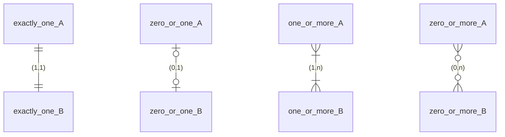
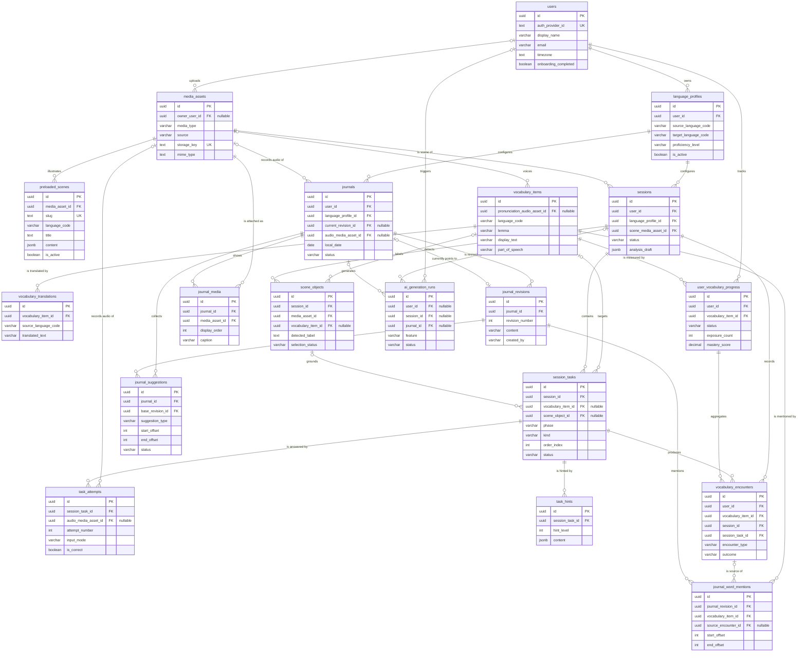

# Entity relationship diagram

This ERD is generated by hand from `backend/prisma/schema.prisma` and uses the
PostgreSQL table and column names, not the Prisma model names. Only key and
identifying columns are listed; see the schema file for every column.

## Reading the cardinality

Mermaid draws crow's-foot notation. Each line end carries a minimum and a
maximum, so `(min,max)` notation maps directly onto the symbols:

| Symbol | Meaning | `(min,max)` |
| --- | --- | --- |
| `||` | exactly one | `(1,1)` |
| `|o` | zero or one | `(0,1)` |
| `}|` | one or more | `(1,n)` |
| `o{` | zero or more | `(0,n)` |

The same legend as Mermaid draws it, each pair using one symbol on both ends:

So `users ||--o{ language_profiles` reads: a language profile belongs to exactly
one user `(1,1)`, and a user has zero or more language profiles `(0,n)`. A
nullable foreign key produces `|o` on the child side, for example
`media_assets.owner_user_id`.

## Diagram

The diagram is wider than the page; scroll it sideways to follow the right-hand
tables.

## Composite and owner-aware foreign keys

Several relationships are enforced through composite foreign keys so a child row
cannot be attached across owners or across scenes:

| Child table | Foreign key columns | Parent |
| --- | --- | --- |
| `sessions` | `(language_profile_id, user_id)` | `language_profiles(id, user_id)` |
| `journals` | `(language_profile_id, user_id)` | `language_profiles(id, user_id)` |
| `scene_objects` | `(session_id, media_asset_id)` | `sessions(id, scene_media_asset_id)` |
| `session_tasks` | `(scene_object_id, session_id)` | `scene_objects(id, session_id)` |
| `vocabulary_encounters` | `(user_id, vocabulary_item_id)` | `user_vocabulary_progress(user_id, vocabulary_item_id)` |
| `vocabulary_encounters` | `(session_id, user_id)` | `sessions(id, user_id)` |
| `vocabulary_encounters` | `(session_task_id, session_id)` | `session_tasks(id, session_id)` |
| `journal_suggestions` | `(base_revision_id, journal_id)` | `journal_revisions(id, journal_id)` |
| `journals` | `(current_revision_id, id)` | `journal_revisions(id, journal_id)` |
| `ai_generation_runs` | `(session_id, user_id)` | `sessions(id, user_id)` |
| `ai_generation_runs` | `(journal_id, user_id)` | `journals(id, user_id)` |

Because `users` is reached transitively through these composite keys,
`sessions`, `journals` and `ai_generation_runs` carry a `user_id` column that is
constrained by the parent row rather than by its own foreign key to `users`.
`journals.current_revision_id` is deferrable so a journal and its first revision
can be inserted in one transaction, which is also why the journal-to-revision
relationship appears twice: once for the full history and once for the pointer
to the current revision.

## Uniqueness worth knowing

- `users.auth_provider_id` and `media_assets.storage_key` are unique.
- At most one active language profile per user (partial unique index in SQL).
- One language-profile pair per user, compared case-insensitively (SQL).
- One vocabulary translation per source language per item, case-insensitively.
- `user_vocabulary_progress` is unique per `(user_id, vocabulary_item_id)`.
- `session_tasks` is unique per `(session_id, order_index)`.
- `task_attempts` is unique per `(session_task_id, attempt_number)`, and
  `task_hints` per `(session_task_id, hint_level)`.
- `journals` is unique per `(user_id, local_date)`.
- `journal_media` is unique per `(journal_id, media_asset_id)` and per
  `(journal_id, display_order)`.
- `journal_revisions` is unique per `(journal_id, revision_number)`.
- `journal_word_mentions` is unique per revision, vocabulary item and offset
  range.
