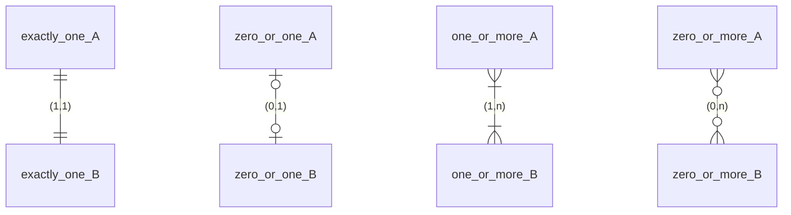
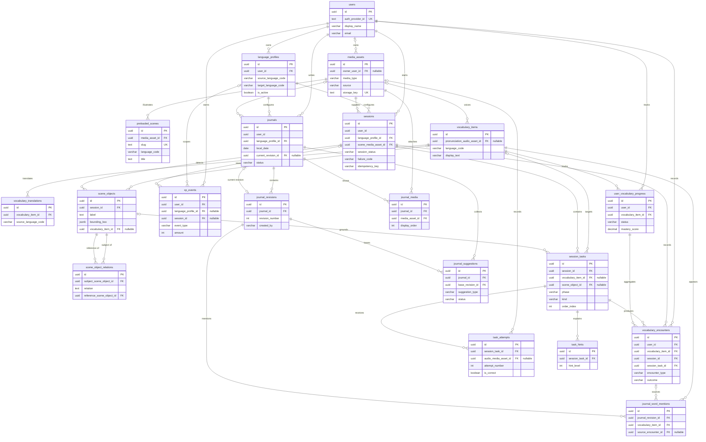

# Entity relationship diagram

This ERD is generated from `backend/prisma/schema.prisma` and uses PostgreSQL
table and column names. Only identifying columns are shown; the schema file is
authoritative for every column and constraint.

## Reading the cardinality

Mermaid crow's-foot ends map to `(min,max)`:

| Symbol | Meaning | `(min,max)` |
| --- | --- | --- |
| `||` | exactly one | `(1,1)` |
| `|o` | zero or one | `(0,1)` |
| `}|` | one or more | `(1,n)` |
| `o{` | zero or more | `(0,n)` |

For example, `users ||--o{ language_profiles` means every profile has exactly
one user and a user may have zero or more profiles. A nullable foreign key
produces an optional child-side end.

## Diagram

The diagram is wider than the page; scroll it horizontally.

The two `scene_object_relations` edges are named Prisma relations
`RelationSubject` and `RelationReference`; both are required foreign keys to
`scene_objects`.

## Composite and owner-aware foreign keys

| Constraint/table | Foreign key columns | Parent |
| --- | --- | --- |
| `sessions_profile_owner_fkey` | `[languageProfileId, userId]` | `language_profiles(id, user_id)` |
| `journals_profile_owner_fkey` | `[languageProfileId, userId]` | `language_profiles(id, user_id)` |
| `session_tasks_scene_object_session_fkey` | `[sceneObjectId, sessionId]` | `scene_objects(id, session_id)` |
| `vocabulary_encounters_session_owner_fkey` | `[sessionId, userId]` | `sessions(id, user_id)` |
| `vocabulary_encounters_task_session_fkey` | `[sessionTaskId, sessionId]` | `session_tasks(id, session_id)` |
| `journals_current_revision_fkey` | `[currentRevisionId, id]` | `journal_revisions(id, journal_id)` |
| `journal_suggestions_base_revision_fkey` | `[baseRevisionId, journalId]` | `journal_revisions(id, journal_id)` |
| `user_vocabulary_progress` parent | `[userId, vocabularyItemId]` | `user_vocabulary_progress(user_id, vocabulary_item_id)` |

SQL also enforces that both endpoints of a scene-object relation belong to the
same session. The current-revision pointer is deferred so a journal and first
revision can be inserted in one transaction. Deferred `NO ACTION` constraints
preserve parent history during atomic updates.

## Uniqueness worth knowing

- `users.auth_provider_id` and `media_assets.storage_key` are unique.
- Language profiles have one active profile and one case-insensitive language
  pair per user.
- `sessions` is unique per `(user_id, language_profile_id, idempotency_key)`.
- `xp_events` is unique per `(user_id, idempotency_key)`.
- Progress is unique per user and vocabulary item.
- Tasks are unique per session/order; attempts and hints are unique by
  task/attempt number and task/hint level.
- Journals are unique per user/local date; journal media and revisions have
  per-parent ordering keys.
- Journal word mentions are unique per revision, vocabulary item, and offset.
