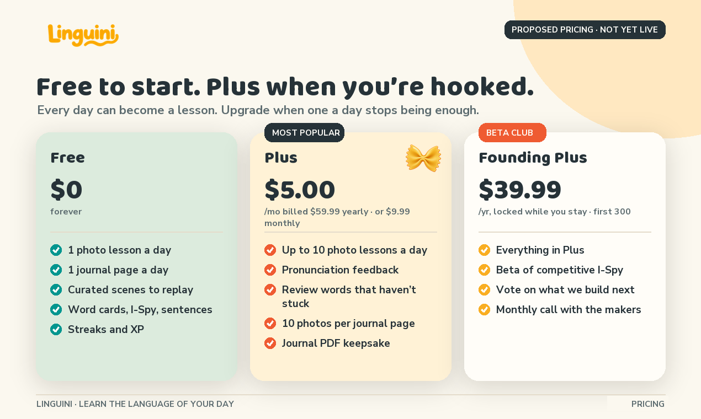
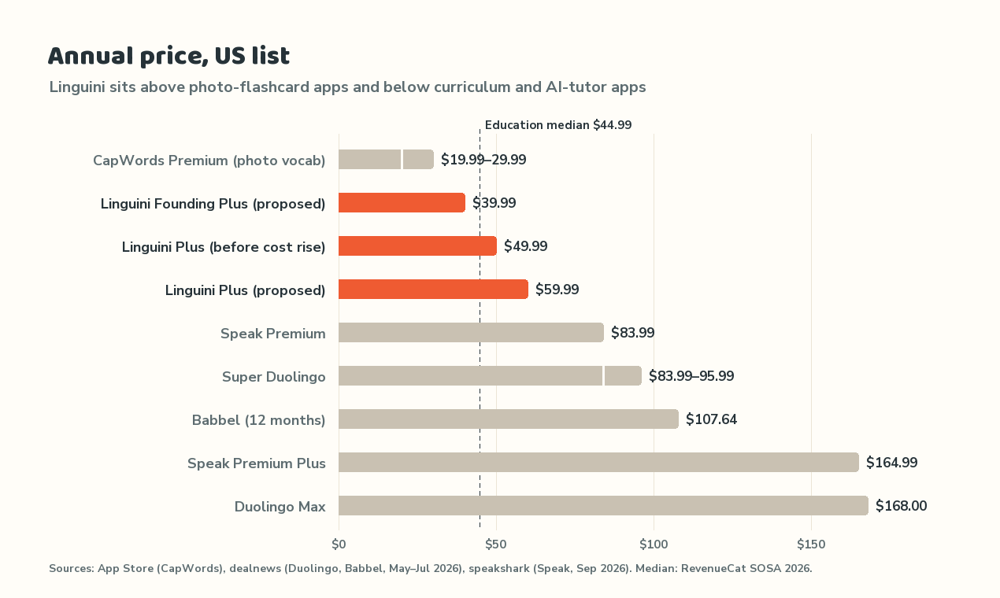
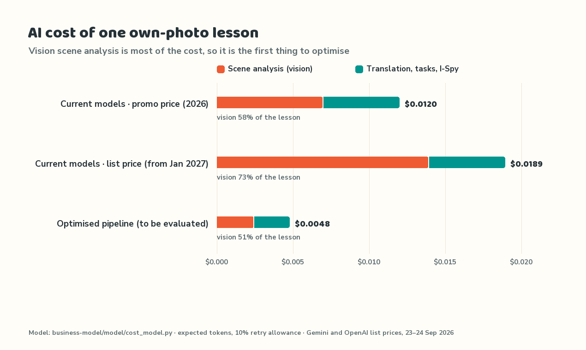
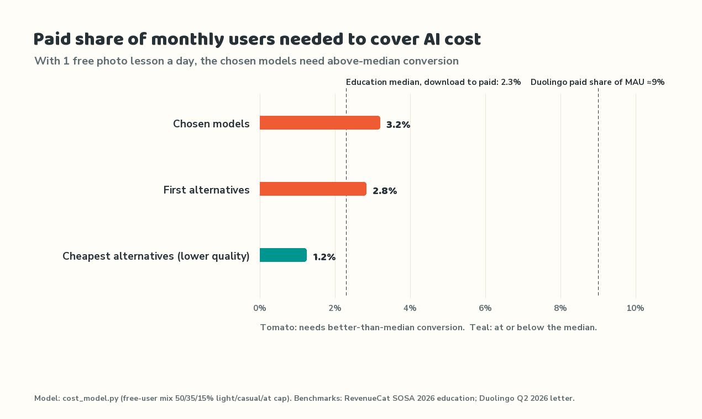

# Linguini business model and pricing

**Working draft, 25 September 2026.** This is a proposal for team review. Nothing here is live. Plus checkout, trials, pronunciation feedback, review mode and PDF export are not built yet (see [the launch kit's readiness audit](../product-hunt/plan.md#current-readiness-audit-24-september-2026)). Every price was checked on the date above and is linked under [Sources](#sources). The cost figures come from a reproducible model, [`model/cost_model.py`](model/cost_model.py), which uses the backend's actual AI call chain and the models the team chose in the [model comparison](https://github.com/CS3216-A3-G7/linguini/blob/main/MODEL_COMPARISON.md). Its token counts are the means measured in that comparison, on the app's own prompts and schemas. Production usage in Langfuse should confirm them once every feature is traced.

## Recommendation in brief

1. **Freemium subscription, gated on AI cost rather than on learning.** Free covers **one own-photo lesson and one journal page a day**, plus unlimited replays of the curated scenes, which cost almost nothing to serve. Plus lifts those limits and adds the features that cost us money to run: more photo lessons, pronunciation feedback and multi-photo journals.
2. **Plus: $9.99 a month or $59.99 a year** ($5.00 a month, 50% off), with a 7-day trial. That is up from $7.99 / $49.99, because the models the team chose raised the cost of a lesson from 1.2¢ to 2.0¢ (see [Why the Plus price rose](#why-the-plus-price-rose)). The monthly price matches the education-app median of $9.99; the annual price sits a little above the $44.99 annual median, still below Duolingo, Babbel and Speak, and above the photo-flashcard app CapWords, which does less.
3. **Founding Plus: $39.99 a year for the first 300 paying members**, locked for as long as they stay subscribed. It includes the competitive I-Spy beta, a vote on the roadmap and a monthly call with the makers. This turns early payers into beta testers, as the team wants, without a lifetime deal whose AI costs would have no ceiling.
4. **Bring the cost of a lesson down before opening the free tier widely.** With the models the team chose (all called through OpenRouter), one own-photo lesson costs about **$0.020 (2.0¢)**. At that cost and the new price, **3.2% of monthly users must pay just to cover AI** (4.1% at the old $7.99 / $49.99). The education-app median is 2.3%. Learning tasks are 51% of the cost and scene analysis 37%. The cheapest alternatives the app accepted would cost $0.008 a lesson and break even at 1.2% paid, but they score lower today. The first step is fixing the learning-task schema defect, so that GPT-4.1-mini, at about half the cost of GPT-5.4-mini, can pass.
5. **Success before revenue means retained learners.** Until the public launch, the headline metric is **weekly learners who finish two or more lessons**. Founding-member sign-ups are the demand signal. Revenue matters once conversion data exists.

## What “success” means at each stage

| Stage | Primary metric | Why this one |
| --- | --- | --- |
| Beta, now to the Product Hunt launch | D7 second-lesson retention and substantive feedback reports (targets are in [`marketing/product-hunt/plan.md`](../product-hunt/plan.md#launch-goals-and-definitions)) | A new learner product fails on retention before it fails on price. |
| Launch year | **Weekly active learners with two or more completed lessons**, plus founding-member count (target: 300) | This measures the habit that Plus monetises. Founding sales show willingness to pay before the pricing is tuned. |
| Traction | Paid share of monthly users, net revenue after AI cost, gross margin | By this stage, conversion has to beat the break-even line shown below. For comparison, Duolingo's gross margin is 72.6%, including its AI features. |

## Tiers

| | **Free** | **Plus** | **Founding Plus** |
| --- | --- | --- | --- |
| Price | $0 | $9.99 a month, or $59.99 a year ($5.00 a month) | $39.99 a year, locked while subscribed; first 300 members |
| Own-photo lessons | **1 a day** | Up to 10 a day (fair use) | As Plus |
| Journal | **1 page a day, 1 photo** | 10 photos a page, AI feedback on your sentences | As Plus |
| Curated scenes | Unlimited replays | Unlimited | Unlimited |
| Games | Word cards, I-Spy, sentence builder | Same, plus a review mode for words that haven't stuck | As Plus |
| Speaking | Browser voice playback and speech input | Pronunciation feedback | As Plus |
| Extras | Streaks, XP, pasta avatar | Journal PDF keepsake, early access to new languages | **Competitive I-Spy beta**, roadmap voting, monthly maker call, name in the credits |
| Trial | — | 7 days | No trial; price shown up front |

The free limits the team chose (one photo lesson and one journal page a day) fit both the cost structure and the product. The daily photo is the habit, and the cap stops a free user from running up cost. Curated scenes are analysed once, offline, by `backend/app/scripts/precompute_preloaded_scenes`. Replaying one costs about $0.0017, for I-Spy guess feedback alone. That makes them a cheap way to keep free users practising after they reach the daily cap.

**Why the Plus price rose.** The earlier proposal of $7.99 / $49.99 was set when a lesson cost about 1.2¢. Moving to the models that passed the team's comparison (Claude Haiku 4.5 for scenes, GPT-5.4-mini for learning tasks) raised it to 2.0¢. At $49.99, net revenue per payer is $5.24 a month and the free tier only pays for itself above 4.1% paid conversion, nearly twice the education median, so even the traction scenario at 4% lost money. At $9.99 / $59.99, net revenue per payer rises to **$6.49 a month**, break-even falls to **3.2%**, and the 4% traction scenario turns from −$284 to +$2,219 a month. $59.99 is still about a third below Duolingo and Speak ($83.99) and half of Babbel. Most education subscribers choose annual plans (59%, per RevenueCat), and an annual subscriber cannot churn for a year, so a 50% annual discount steers buyers toward the plan we want them on. Treat $59.99 against $49.99 as the first price test once real conversion data exists.

## How Duolingo and others split free from paid

| Product | Free tier | What paying unlocks | What Linguini takes from it |
| --- | --- | --- | --- |
| **Duolingo** | All lessons, but mobile has an energy system: about 2–3 lessons a day, with ads. Desktop web has no energy limit. | Super (about $12.99 a month, $84–96 a year): unlimited energy, no ads, personalised practice. **Max** (about $29.99 a month, $168 a year): AI Video Call and Roleplay. Family plan: $119.99 a year for up to 6 people. | The free product stays genuinely usable. The limit falls on volume, and the most expensive AI features sit in a higher tier. Our version: limit own-photo AI, not learning. Hold a "Max-style" tier back until competitive I-Spy and conversation exist. |
| **CapWords** (photo vocabulary, Apple Design Award 2025) | A small number of free captures, then limited features | Pro: unlimited captures and full review, $4.99–5.99 a month or $19.99–29.99 a year | Our closest rival also gates on captures, so the market accepts a limit on photos. |
| **Speak** (AI speaking tutor) | Limited free access (details vary by region) | Premium: $17.99 a month or $83.99 a year. Premium Plus: $39.99 a month or $164.99 a year. | Speaking feedback commands a premium, so pronunciation belongs in Plus. |
| **Babbel** | Limited free lessons | $15.25 a month on a 3-month plan, $107.64 a year, $299 lifetime | Babbel can offer a lifetime deal because its lessons are static content. Ours generate AI costs every time, so we should not copy it. |
| **Busuu / Memrise** | Free tier with limited features | Busuu Premium: $9.99 a month (one language), $13.99 (all). Memrise: $8.99 a month. | Monthly prices cluster at $8.99–13.99. Our $9.99 sits at the low end. |

## Competitor analysis and our advantage

| Segment | Examples | Their strength | Where Linguini differs |
| --- | --- | --- | --- |
| Curriculum apps | Duolingo (58.7M daily users; $298.5M Q2 2026 revenue), Babbel, Busuu | Structured paths, brand, scale | Their content is generic: *la manzana* whether or not you own an apple. Linguini's words come from the learner's own day. |
| AI conversation tutors | Speak, Duolingo Max | Speaking practice | They cost $84–168 a year and centre on conversation drills. Linguini starts from the concrete things in front of the learner, which suits beginners and people returning to a language. |
| Photo-to-vocabulary apps | CapWords, Vocam, SnapLingo, Photo Vocabulary Builder, Linget | Capture a photo, get a flashcard | They stop at the flashcard. Linguini turns the photo into **games (I-Spy with AI-graded descriptions, sentence building) and a journal page**. The journal is a reason to come back tomorrow, not just a vocabulary list. |
| Free general tools | Google Lens, ChatGPT | Free, instant translation | They translate but do not teach, practise or remember. |

**Our competitive advantage**

- **One loop from photo to practice to journal.** Each word is tied to a moment the learner actually lived and is reused in a sentence the same day. No competitor we checked combines photo capture, games and a journal.
- **Social play is on the roadmap.** Competitive I-Spy on shared photos would bring network effects, which none of the photo-vocabulary apps have. Founding Plus members help shape it.
- **Runs in the browser.** There is nothing to install, it works on a laptop in class, and there are no app-store fees. Web checkout nets about $6.49 a month per payer, against $5.99 through an app store.
- **Structural cost advantage on curated content.** Curated scenes are computed once, so the free tier can stay generous where it costs nothing.

**Honest weaknesses.** CapWords has Apple's design awards and supports 9 languages; we have Spanish and French. Duolingo's free tier is large and polished. Photo analysis, speech grading and checkout are not in production yet. We have no app-store presence. The pricing argument depends on shipping the Plus features before we charge for them.

## Perceived value

- **Against tutoring:** online Spanish tutors cost $20–40 an hour and French tutors $15–60 (italki, 2026). Plus at $5.00 a month costs less than 15 minutes with a typical $20–40-an-hour tutor. It is not a substitute for one; it is daily practice between lessons.
- **Against the category:** RevenueCat's 2026 education medians are **$9.99 a month and $44.99 a year**, with **2.3% of downloads converting to paid** by day 35 and 59% of subscriptions sold as annual plans. Education trial users produce 50.4% more 12-month revenue than people who buy without a trial. Half of education trials run 5–9 days, hence our 7-day trial.
- **Ceiling:** Duolingo's paid subscribers are about 9% of its monthly users (12.7M of 140.6M). That is what a mature, much-loved product achieves; do not plan on it.

## Production costs and AI inference

### Cost of one lesson

These calls happen for each own-photo lesson in the backend (`backend/app/ai/`, `backend/.env.example`). Every call goes through one OpenRouter key, and each call is a separate setting. Token counts are the means measured in the model comparison, including image and reasoning tokens. The cap is the output limit billed in the worst case.

| Step | Chosen model (via OpenRouter) | Measured tokens in / out (cap) | Cost, chosen | Cost, first alternative |
| --- | --- | --- | --- | --- |
| Image moderation | `omni-moderation-latest` (optional) | n/a | free | free |
| Scene analysis (vision) | `anthropic/claude-haiku-4.5` | 3,375 / 664 (1,500) | $0.0074 | $0.0110 (GPT-4o) |
| Translation | `openai/gpt-4o-mini` | 648 / 216 (1,500) | $0.0003 | $0.0003 (Mistral Small) |
| Learning tasks | `openai/gpt-5.4-mini` | 2,831 / 1,597 (4,000) | **$0.0102** | $0.0045 (GPT-4.1-mini) |
| I-Spy clues | `google/gemini-3.1-flash-lite` | 938 / 124 (1,500) | $0.0005 | $0.0002 (GPT-4o-mini) |
| I-Spy guess feedback, about 3 guesses | `openai/gpt-4.1-mini` | 1,025 / 70 (1,500) each | $0.0017 | $0.0018 (Gemini 3.5 Flash-Lite) |
| **Total, with a 10% retry allowance** | | | **$0.0200** | **$0.0178** |
| Worst case: every output at its cap, every call retried | | | $0.0971 | $0.1017 |

Learning tasks are now the biggest share of a lesson (51%), followed by scene analysis (37%). The first alternatives cost slightly less in total, but only because GPT-4.1-mini is cheaper for tasks; its lessons are rarely accepted today (see below).

### Which model runs each call

The team chose one model per call from a [comparison](https://github.com/CS3216-A3-G7/linguini/blob/main/MODEL_COMPARISON.md) that ran every candidate through the app's own prompts, schemas and validators: 14 labelled photos, 17 translation cases, 6 scenes and 22 learner descriptions. Temperature is 0 everywhere, because raising it hurt every call tested. Spreading calls across providers is deliberate: an outage at one provider downgrades one feature, not the app.

| Call | Chosen (via OpenRouter) | Main alternatives | Why |
| --- | --- | --- | --- |
| Scene analysis | Claude Haiku 4.5 | GPT-4o, GPT-4.1-mini, Gemini 3.7 Flash | Highest quality (0.79), found every anchor object, and the only candidate the app accepted every time, at a third of GPT-4o's cost. The previous default, Gemini 3.7 Flash, failed every call. |
| Scene translation | GPT-4o-mini | Mistral Small, Claude Haiku 4.5, Gemini 3.5 Flash-Lite | 0.95 quality and 100% accepted, at the same price as Mistral Small, which OpenRouter rate-limited on 12 of 51 calls. |
| Learning tasks | GPT-5.4-mini | GPT-4.1-mini, Gemini 3.5 Flash-Lite, GPT-4o-mini | The only model that reliably satisfies the lesson schema (75% accepted against 0–12% for the rest) and the highest quality (0.92). The most expensive call. |
| I-Spy clues | Gemini 3.1 Flash-Lite | GPT-4o-mini, Claude Haiku 4.5 | 0.98 quality and a perfect language score, never leaked the answer word, at a fifth of Claude's cost. |
| I-Spy guess and feedback | GPT-4.1-mini | Gemini 3.5 Flash-Lite, GPT-4o-mini, Claude Haiku 4.5 | Best guess accuracy (0.97), and it reads directional traps correctly. |

This model tracks three sets. **Chosen** is the table above. **First alternatives** is the first alternative for every call, what we would run if every chosen provider failed. **Cheapest alternatives** is the cheapest model the app still accepted for each call: GPT-4.1-mini for scene analysis and learning tasks, GPT-4o-mini for the rest. It is not a drop-in switch. Scene analysis scores 0.69 against 0.79, and GPT-4.1-mini's lessons are accepted only 12% of the time until the schema defect is fixed.

Other per-use costs: planned journal feedback on GPT-4o-mini is about $0.0006 a page. Word audio uses the browser's built-in voice today, so it costs nothing. Pronunciation feedback, a Plus feature, costs about **$0.0033 a lesson** using `gpt-4o-mini-transcribe` ($0.003 a minute) plus a text comparison. Azure's scored pronunciation assessment would cost about **$0.027 a lesson**, eight times as much. Use it only if the cheaper approach does not give useful feedback.

**Storage and bandwidth are small.** Supabase Pro includes 100 GB of storage (then $0.0213 per GB-month) and 250 GB of egress (then $0.09 per GB). One stored photo (about 3 MB with its derivatives) costs about $0.00006 a month.

**Fixed costs to charge money:** Vercel's Hobby plan is non-commercial, so landing and app hosting need Pro at $20 a month. Supabase Pro is $25 a month and includes 100,000 monthly active users. The API on Render costs $7 a month (Starter), rising to $25 (Standard) at scale. **Total: $52–70 a month.** At every scale we modelled, the variable AI cost outweighs the fixed cost.

**Payment fees:** Stripe as quoted for our Singapore account is 3.4% + $0.50, plus 0.5% for international cards and 0.7% for Billing. App stores take 15% under Apple's Small Business Program and on all Google Play subscriptions. The $0.50 fixed fee makes a monthly plan on the web cost proportionally more than an annual one. That is another reason to push the annual plan.

### Cost per user per month

| Profile (sessions a month) | Chosen models | First alternatives | Cheapest alternatives |
| --- | --- | --- | --- |
| Free, light (2 photo lessons) | $0.04 | $0.04 | $0.02 |
| Free, casual (8) | $0.17 | $0.16 | $0.07 |
| Free, at the daily cap (30) | $0.64 | $0.58 | $0.27 |
| Plus, typical (30, with speaking) | $0.74 | $0.68 | $0.37 |
| Plus, heavy (90) | $2.17 | $1.98 | $1.06 |
| Plus at the 10-a-day ceiling (300) | $7.13 | $6.47 | $3.47 |

Across the assumed mix, the average free user costs about $0.18 a month and the average Plus user $1.03 on the chosen models. Net revenue per payer is about **$6.49 a month** on the web. A typical Plus user is profitable under every set. A Plus user who hits the 10-a-day cap every day costs more than they pay under the chosen models. That is acceptable if rare, and the cap exists to bound it.

### How cost scales, and the break-even line

The risk is not the payers. It is **the free users each payer carries**. At 2.3% conversion, every payer supports about 42 free users.

| Scenario (option B pricing) | Monthly users | Payers | Net revenue | AI cost (free + Plus) | Fixed | Monthly result |
| --- | --- | --- | --- | --- | --- | --- |
| Beta, chosen models | 300 | 7 | $45 | $60 | $52 | **−$67** |
| Beta, cheapest alternatives | 300 | 7 | $45 | $26 | $52 | −$33 |
| Launch year at 2.3%, chosen models | 5,000 | 115 | $747 | $997 | $52 | **−$303** |
| Launch year at 2.3%, cheapest alternatives | 5,000 | 115 | $747 | $426 | $52 | **+$269** |
| Traction at 4%, chosen models | 50,000 | 2,000 | $12,983 | $10,695 | $70 | **+$2,219** |
| Traction at 4%, first alternatives | 50,000 | 2,000 | $12,983 | $9,641 | $70 | +$3,273 |
| Traction at 4%, cheapest alternatives | 50,000 | 2,000 | $12,983 | $4,623 | $70 | **+$8,290** |

The beta loses about $67 a month. That is affordable as a research cost and tells us the real usage. At the new price the chosen models break even at 3.2%, so 4% conversion is profitable, but at the 2.3% median the launch year still loses about $300 a month. **Before a broad free launch, the team should do three things:**

1. **Fix the learning-task schema defect so GPT-4.1-mini can pass.** Lessons are rejected when a model returns one question for a task that asks for two to four, because providers do not enforce the schema's minimum in strict mode. Either accept one question for that task type or state the count per task in the prompt. GPT-5.4-mini is the only model that passes today, and learning tasks are half the cost of a lesson. GPT-4.1-mini costs about half as much for that call.
2. **Test the cheaper alternatives against the same evaluation.** The cheapest set breaks even at 1.2% paid, well below the median, but scene analysis on GPT-4.1-mini scores 0.69 against 0.79 and its lessons are accepted 12% of the time. Re-run the comparison's photos, scenes and learner descriptions after the schema fix, and switch a call only if quality and acceptance stay within an agreed margin.
3. **Enforce limits and track cost on the server.** Limit own-photo analysis per user per local day in the API (one for Free, ten for Plus), not only in the UI. Extend Langfuse tracing, which today covers only I-Spy guesses, to every AI feature with token counts. Alert when the average cost per lesson over 7 days exceeds $0.03.

## Revenue streams

| Stream | When | Notes |
| --- | --- | --- |
| **Plus subscriptions**, monthly and annual | At launch, once checkout works end to end | Core revenue. Sell on the web first: no store fees, and the app is a web app. |
| **Founding Plus** | From public launch; closes at 300 members or 31 Dec 2026, whichever comes first | Early revenue, committed testers and a demand signal. Nets $3.14 a month per member against about $1.03 in AI cost under the chosen models. |
| Family plan (for example $79.99 a year for up to 4) | After retention is proven | Duolingo's family plan is $119.99 for 6. Every member uses AI, so price per seat rather than copying Duolingo's generosity. |
| Classroom licences | Year 2 | Teachers set a daily scene and students journal about it. Longer sales cycle, but the fit with teaching is natural. |
| Printed journal photo book (one-off) | Once the PDF export ships | Fits the "keep the day" idea. Needs a print-on-demand vendor quote before we set a price. |
| Gift subscriptions | Seasonal | Low effort once Stripe Billing is live. |

## Alternatives we weighed

| Model | Fit with cost structure | Fit with learners | Verdict |
| --- | --- | --- | --- |
| **Freemium subscription, capped by AI use** | Good: limits bound the cost of free users | Good: a daily habit, and the upgrade trigger is "I want another photo lesson" | **Chosen** |
| Pay per use (packs of photo lessons, token credits) | Best: revenue tracks cost directly | Poor: metering undermines the daily habit, and a vocabulary app is not a developer tool | Rejected as the main model; could return as a Plus top-up if the fair-use cap is ever hit often |
| Hard paywall after a trial | Good | Poor: the journal and word-of-mouth loop needs free users, and a Product Hunt audience expects to try before paying | Rejected |
| Ads in the free tier | Weak: our small audience would earn little | Poor: ads next to a learner's personal photos and journal harm trust, and they interrupt the lesson | Rejected |
| Lifetime deal (like Babbel's $299) | **Dangerous**: AI cost keeps coming every day for life, with no ceiling | Popular | Rejected. Founding Plus gives the "early supporter" reward with renewing revenue |
| Higher "Max-style" tier ($12–15 a month) | Good for expensive features | Premature: competitive I-Spy and conversation don't exist yet | Revisit when those features ship |

## Founding Plus and the beta club

The team wants early payers to become beta testers and help steer the product. Founding Plus does this on the following terms:

- **Offer:** $39.99 a year, 33% below Plus. The price is locked for as long as the subscription renews, with no lifetime deal. Limited to 300 members, and the spots-remaining count shown must be real.
- **What members get:** everything in Plus; an early-access channel for **competitive I-Spy** and other experiments; a vote each month on the roadmap (for example a GitHub Discussions poll or a simple voting board); a monthly 30-minute maker call; and their names in the credits if they opt in.
- **What we ask:** one short survey after their first week and one feature test a month, all optional. Feedback goes to the team's product owner, who replies publicly with what changed.
- **Fairness rule for competitive play:** paying buys early access and a vote, never an advantage in ranked I-Spy. Any rewards for Founding members are cosmetic, such as a badge or a pasta avatar.
- **Opening condition:** Founding Plus opens only when Plus checkout, entitlements and cancellation work end to end, as the [launch go/no-go](../product-hunt/plan.md#go--no-go-at-t1) requires. Until then, promote the free beta and collect interest without taking payment.

## Landing page status

The landing page (`landing/data/pricing.ts`) now shows $9.99 / $59.99, Founding Plus at $39.99 and a "Save 50%" badge, with the free limits and the 10-a-day Plus cap. Still to do: hide Plus features and the trial button until they work in production.

## Media kit

Regenerate with `python3 marketing/business-model/model/cost_model.py && python3 marketing/business-model/media/render.py` (requires Pillow). The renderer reuses the helpers in `marketing/media/render.py` and the landing site's brand assets. Photographs are credited in `landing/public/photos/credits.json`; confirm their rights before posting, as the launch media kit notes.

| Asset | Use | Size |
| --- | --- | --- |
| [`pricing-tiers.png`](media/export/pricing-tiers.png) | Product Hunt gallery slide, pitch deck, landing page reference | 1270 × 760 |
| [`founding-plus-square.png`](media/export/founding-plus-square.png) | Instagram, LinkedIn and Facebook post for the founding offer | 1080 × 1080 |
| [`founding-plus-story.png`](media/export/founding-plus-story.png) | Instagram and TikTok story | 1080 × 1920 |
| [`chart-competitor-prices.png`](media/export/chart-competitor-prices.png) | Competitor price comparison | 1270 × 760 |
| [`chart-session-cost.png`](media/export/chart-session-cost.png) | AI cost of one lesson | 1270 × 760 |
| [`chart-breakeven-conversion.png`](media/export/chart-breakeven-conversion.png) | Break-even conversion against benchmarks | 1270 × 760 |

Every promotional asset is labelled as a proposed offer. Remove that label only when the offer is live.

**Suggested post for the founding offer (use only once checkout works):**

> We're opening 300 Founding Plus spots for Linguini, the app that turns a photo of your day into a Spanish or French lesson. $39.99 a year, locked for as long as you stay. You'll play competitive I-Spy before anyone else and vote on what we build next. Free stays free: one photo lesson and one journal page every day. [link]

## Assumptions to replace with real data

| Assumption | Current value | How to measure |
| --- | --- | --- |
| Tokens per call | Means measured in the model comparison on the app's own prompts and test cases, with output caps for the worst case | Langfuse usage on every AI feature during the beta, with real learner photos |
| Mix of free users | 50% light, 35% casual, 15% at the daily cap | Product analytics: own-photo lessons per monthly user |
| Mix of Plus users | 80% typical, 20% heavy | Same, for paying users |
| Paid conversion | 2.3% (RevenueCat education median) | Beta and launch cohorts |
| Annual share of plans | 59% (RevenueCat education) | Stripe |
| Pronunciation audio | 1 minute a lesson | Recorded audio duration |

## Sources

Checked 23–24 September 2026.

- AI model prices: the [OpenRouter model catalogue](https://openrouter.ai/models) (provider list price), as snapshotted in the team's [model comparison](https://github.com/CS3216-A3-G7/linguini/blob/main/MODEL_COMPARISON.md), which is also the source of the measured tokens, quality and acceptance rates
- OpenAI transcription, TTS and moderation prices: [developers.openai.com/api/docs/pricing](https://developers.openai.com/api/docs/pricing)
- Azure pronunciation assessment: [Azure Speech pricing](https://azure.microsoft.com/en-us/pricing/details/speech/) and a [Microsoft Q&A answer on pricing](https://learn.microsoft.com/en-us/answers/questions/5608069/pricing-and-usage-of-pronunciation-assessment-feat)
- Supabase: [pricing](https://supabase.com/pricing), [storage overage](https://supabase.com/docs/guides/platform/manage-your-usage/storage-size). Vercel: [pricing](https://vercel.com/pricing). Render: [free tier limits](https://render.com/docs/free) and [Starter at $7](https://www.srvrlss.io/provider/render/)
- Stripe: [pricing](https://stripe.com/pricing), as served to the team's region. App store commissions: [RevenueCat on the 15% fee](https://www.revenuecat.com/blog/engineering/small-business-program)
- Duolingo Q2 2026 results: [shareholder letter, SEC 8-K](https://www.sec.gov/Archives/edgar/data/0001562088/000162828026053299/q2fy26duolingo6-30x26share.htm). Prices: [dealnews, May 2026](https://www.dealnews.com/features/duolingo/cost/). Energy system: [duoplanet](https://duoplanet.com/duolingo-energy-system/), [Hello Nabu](https://www.hellonabu.com/blog/en/is-duolingo-free/)
- Babbel: [dealnews](https://www.dealnews.com/features/babbel/plan-pricing/). Speak: [speakshark, Sep 2026](https://speakshark.com/blog/speak-app-pricing-per-month-2026). Busuu and Memrise: [testprepinsight](https://testprepinsight.com/reviews/busuu-review/), [speakingtongue](https://speakingtongue.com/busuu-vs-memrise/)
- CapWords: [App Store listing](https://apps.apple.com/us/app/capwords-ai-photo-vocabulary/id6738896465), [FAQ](https://capwords.app/faqs). Vocam: [vocam.app](https://vocam.app/). Other photo-vocabulary apps: [SnapLingo](https://play.google.com/store/apps/details?id=com.dg.snaplingo&hl=en), [Linget](https://apps.apple.com/us/app/linget-ai-photo-vocabulary/id6764288013)
- Category benchmarks: [RevenueCat State of Subscription Apps 2026, Education](https://www.revenuecat.com/state-of-subscription-apps-2026-education)
- Tutor prices: [italki Spanish](https://www.italki.com/en/blog/spanish-tutor-cost), [italki French](https://www.italki.com/en/blog/french-tutor-cost)
- Founding-member pricing practice: [Membership.io](https://membership.io/blog/founding-member-pricing)
- Market size (definitions vary widely): [Business of Apps](https://www.businessofapps.com/data/language-learning-app-market/), which reports $1.54B in 2025 app revenue
